# APT Casino - Mermaid Architecture Diagrams

## 🏗️ System Architecture Overview

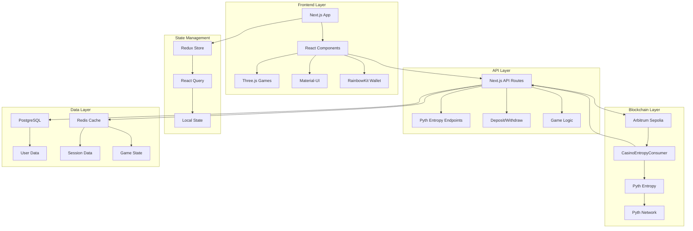

## 🔄 Application Bootstrap Flow

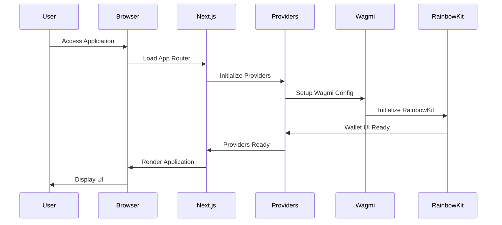

## 🔗 Wallet Connection Flow

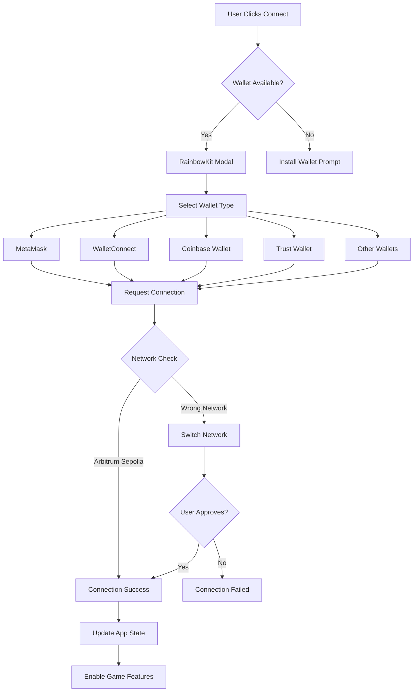

## 🎲 Pyth Entropy Integration Architecture

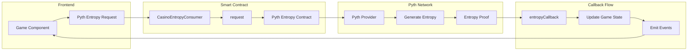

## 🎮 Game Execution Flow

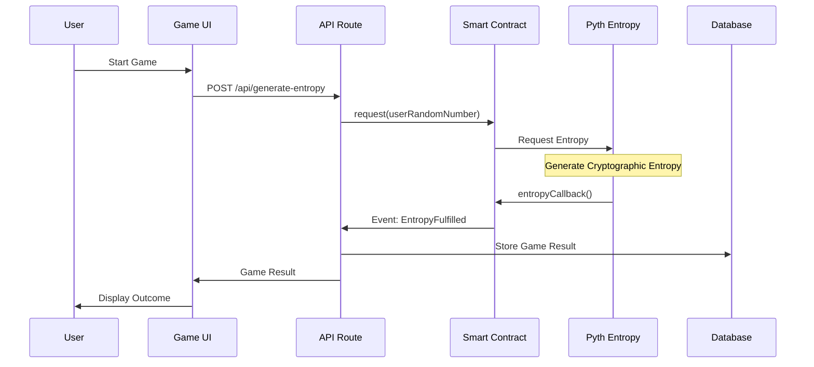

## 🏗️ Smart Contract Deployment Flow

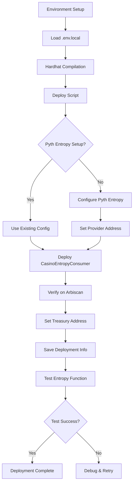

## 🎯 Game-Specific Flows

### Mines Game Flow
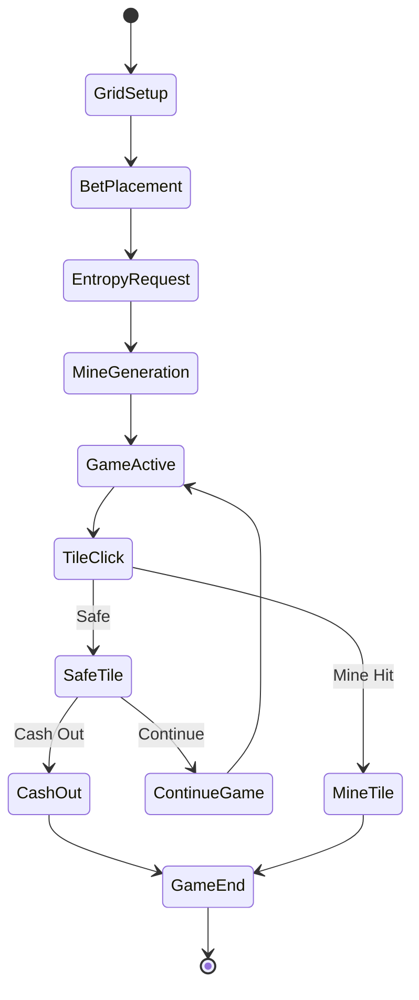

### Plinko Game Flow
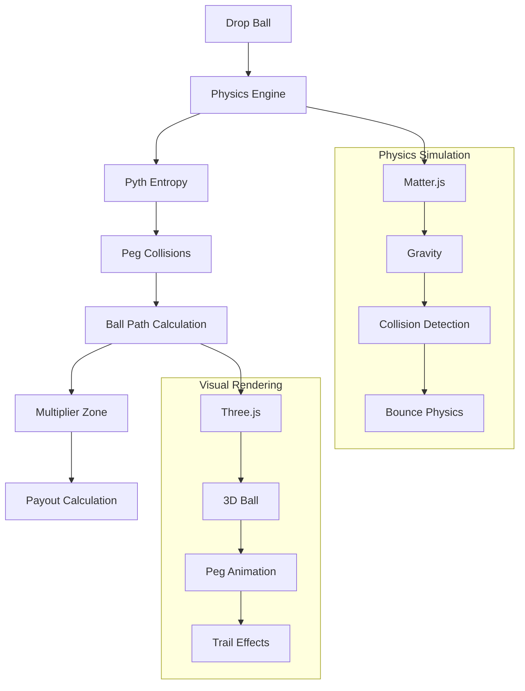

### Roulette Game Flow
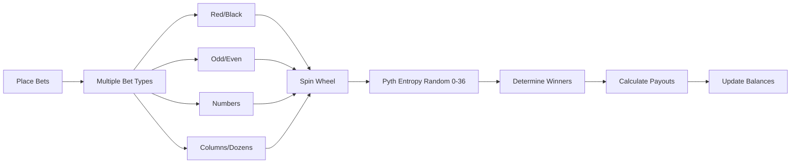

## 🔐 Security & Access Control

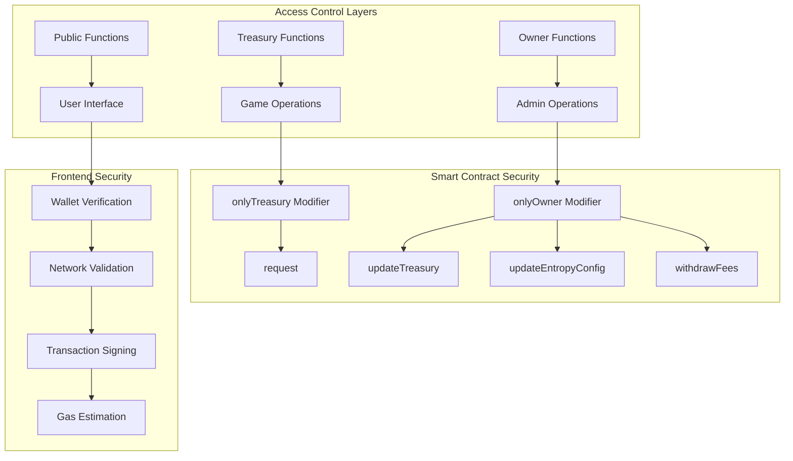

## 📊 Data Flow Architecture

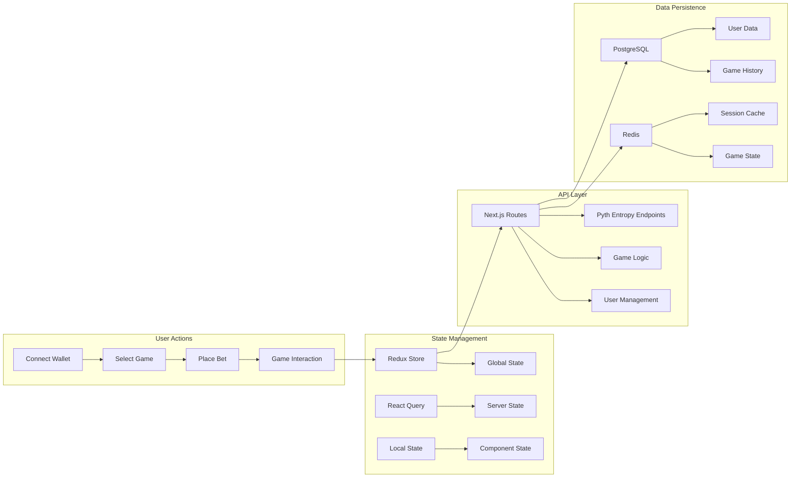

## 🔄 Request-Response Cycle

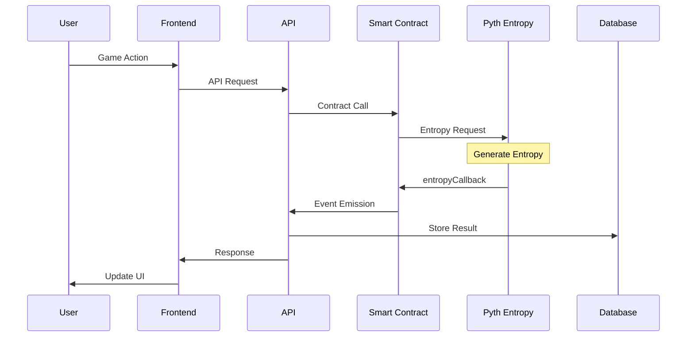

## 🔧 Development Workflow

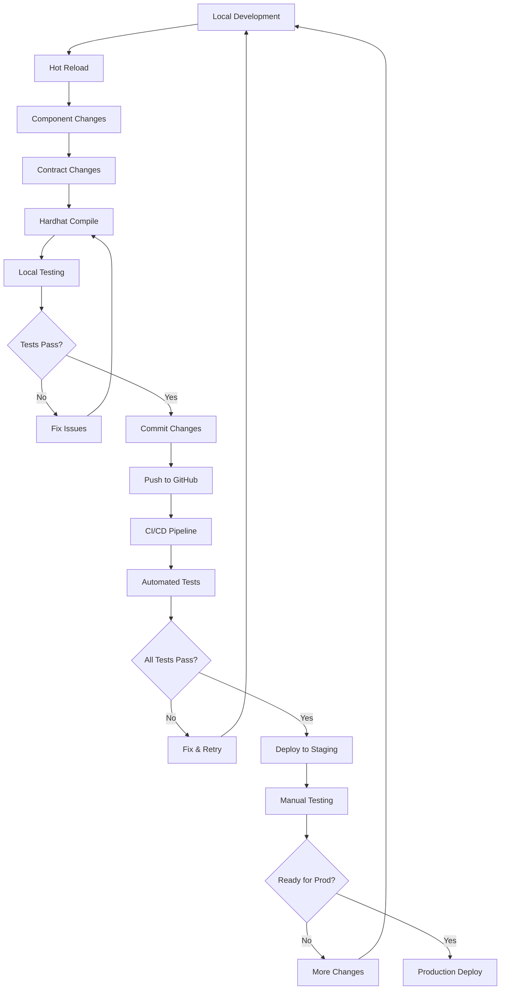

## 📈 Performance Monitoring

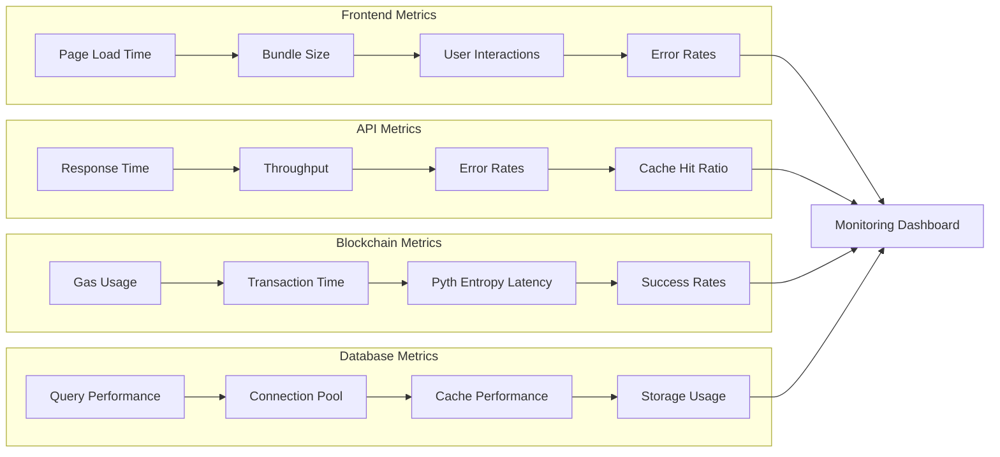

## 🔮 Pyth Entropy Service Integration

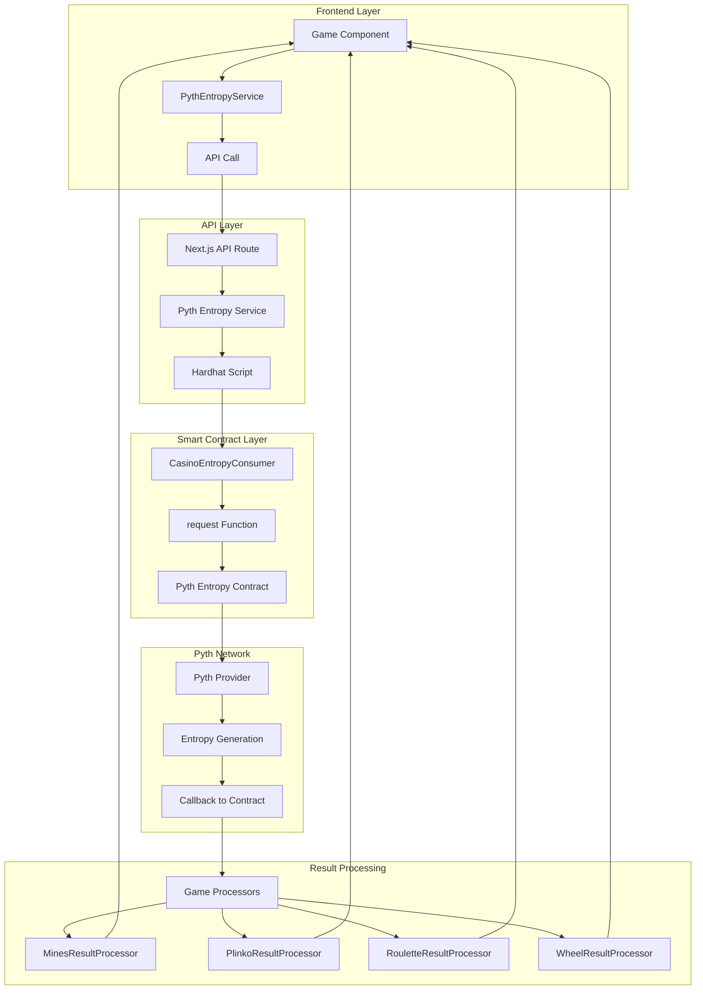

## 🎯 User Journey Flow

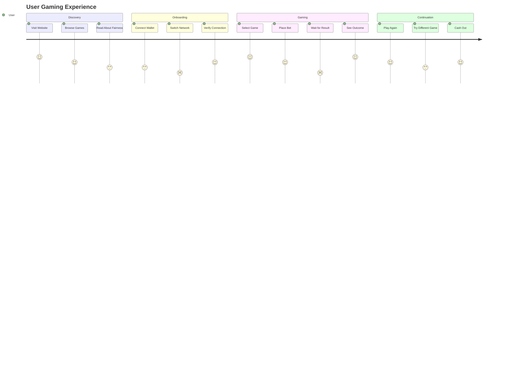

This comprehensive set of Mermaid diagrams provides visual representations of all major architectural components and flows in the APT Casino application, making it easier to understand the complex interactions between different system layers. The diagrams now accurately reflect the current Pyth Entropy integration for random number generation instead of Pyth Entropy.