# Stacks Casino - Mermaid Architecture Diagrams

## 🏗️ System Architecture Overview

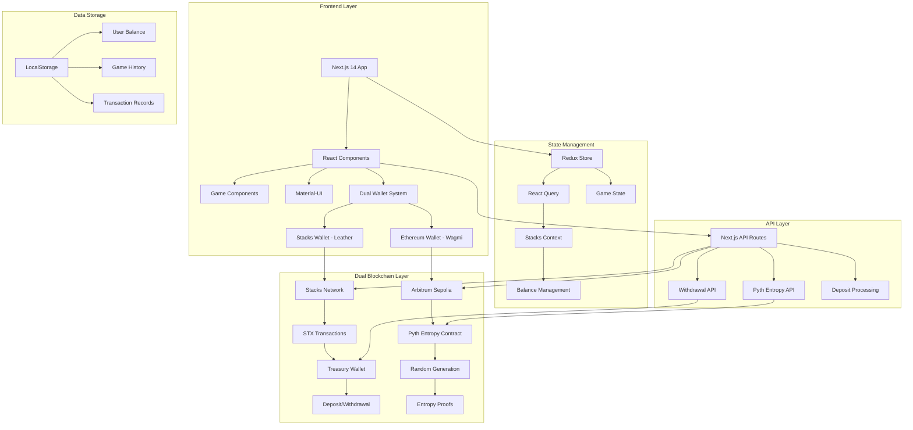

## 🔄 Application Bootstrap Flow

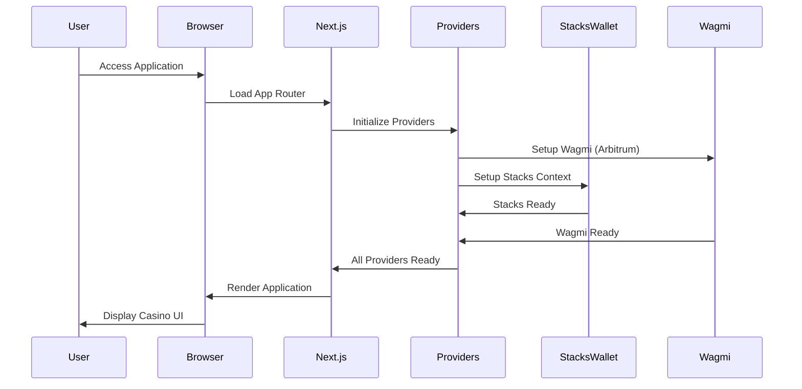

## 🔗 Dual Wallet Connection Flow

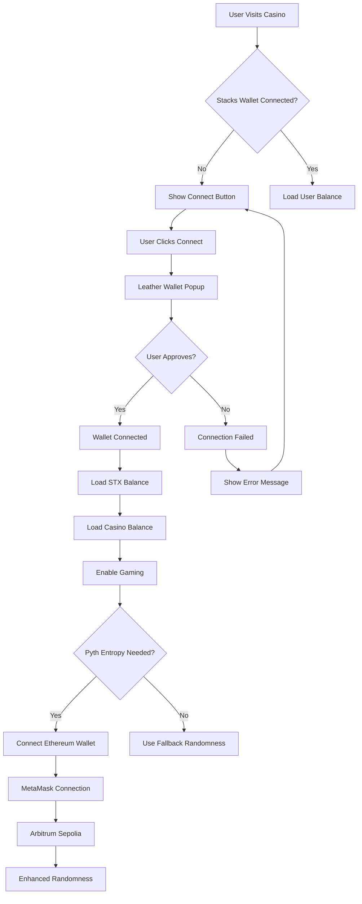

## 💰 STX Deposit Flow

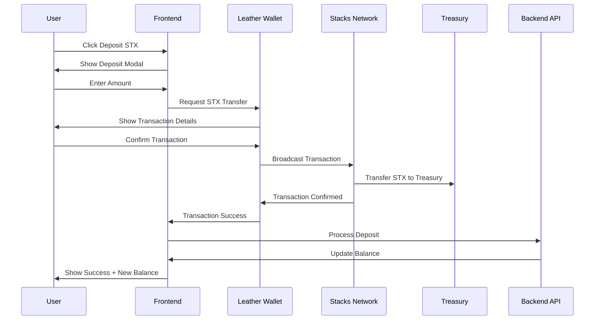

## 💸 STX Withdrawal Flow

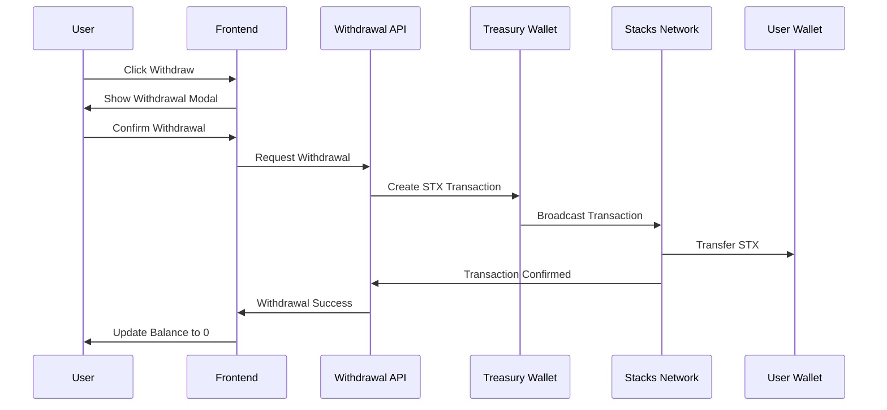

## 🎲 Game Flow with Pyth Entropy

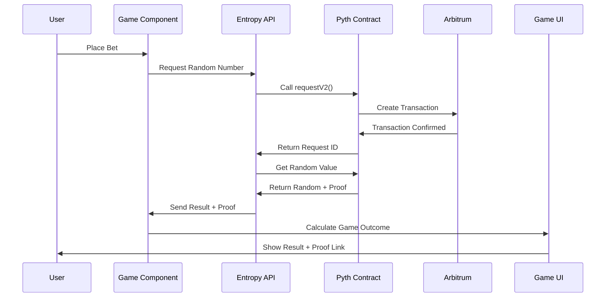

## 🎮 Plinko Game Architecture

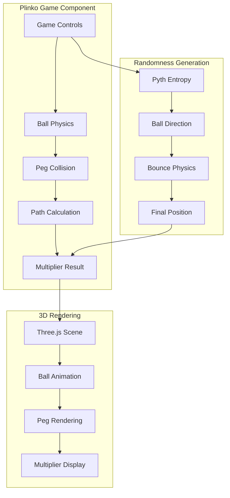

## 🏦 Treasury Management System

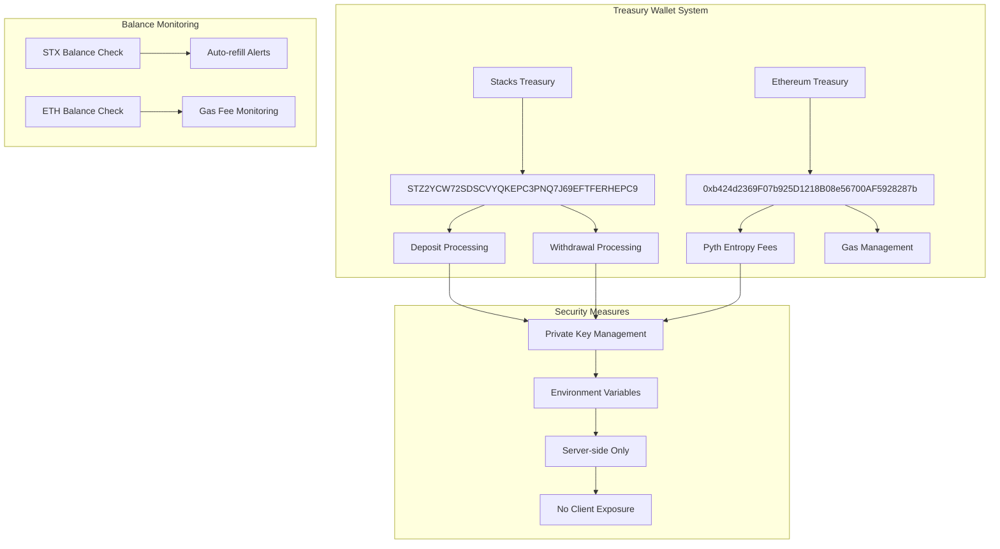

## 🔐 Security Architecture

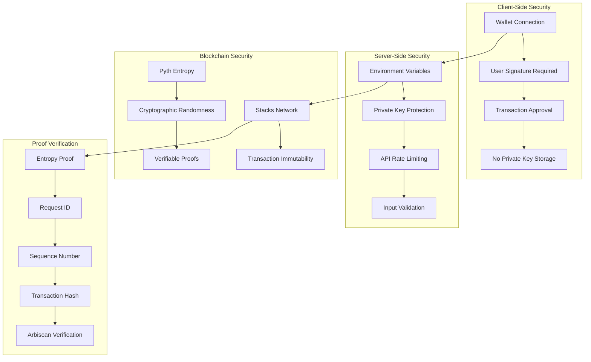

## 📊 Data Flow Architecture

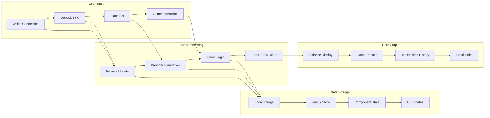

## 🌐 Network Integration

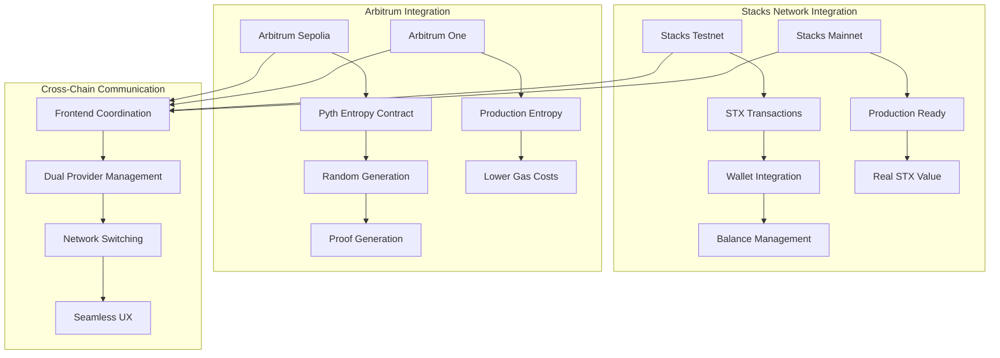

## 🎯 Game State Management

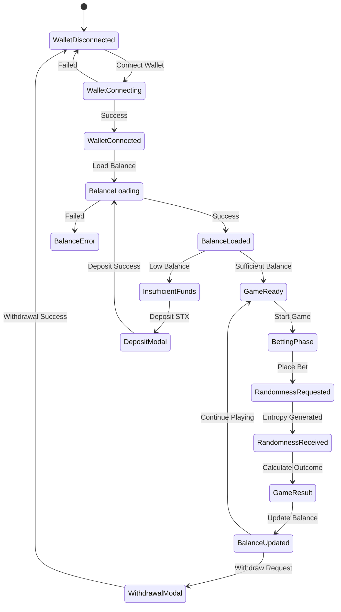

---

## 📝 Diagram Usage Notes

### Viewing Diagrams
- Copy any mermaid code block
- Paste into [Mermaid Live Editor](https://mermaid.live/)
- Or use VS Code with Mermaid extension

### Updating Diagrams
- Modify mermaid syntax as needed
- Test in Mermaid Live Editor
- Update this file with changes

### Integration
- These diagrams document the current architecture
- Update when making significant system changes
- Use for onboarding new developers

---

**Built with ❤️ for Stacks Network** 🚀