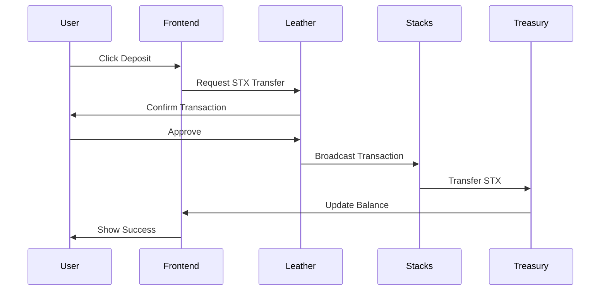
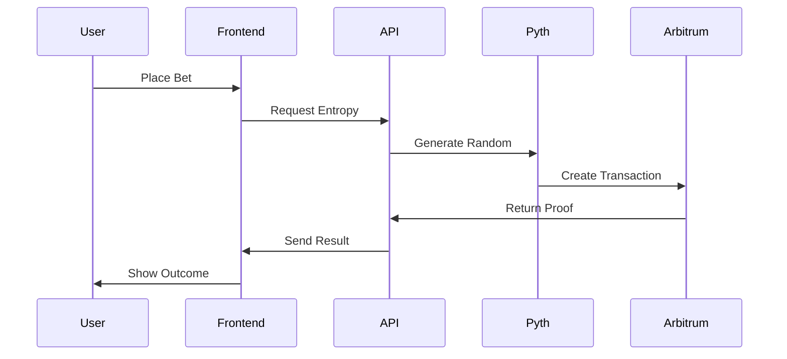

# APT-Casino

A couple of days back, I was was on etherscan exploring some transactions and saw an advertisement of https://stake.com/ which was giving 200% bonus on first deposit, I deposited 120 USDT into stake.com they gave 360 USDT as total balance in their controlled custodial wallet and when I started playing casino games I was shocked to see that I was only able to play with $1 per game and was unable to increase the betting amount beyond $1 coz and when I tried to explore and play other games on the platform the issue was persisting, I reached the customer support and got to know that this platform has cheated him under the name of wager limits as I was using the bonus scheme of 200%.

When I asked the customer support to withdraw money they showed a rule list of wager limit, which said that if I wanted to withdraw the deposited amount, then I have to play $12,300 worth of gameplay and this was a big shock for me, as I was explained a maths logic by their live support. Thereby, In the hope of getting the deposited money back, I played the different games of stake.com like roulette, mines, spin wheel, etc, the entire night and lost all the money.

I was very annoyed of that's how **APT-Casino** was born, which is a combination of GameFi and DeFi all in one platform where new web3 users can play games, perform gambling, but have a safe, secure, transparent platform that does not scam any of their users. Also, I wanted to address common issues in traditional gambling platforms.

## 🧩 Problems

The traditional online gambling industry is plagued by several issues, including:

- **Unfair Game Outcomes:** 99% of platforms manipulate game results, leading to unfair play.  
- **High Fees:** Users face exorbitant fees for deposits, withdrawals, and gameplay.  
- **Restrictive Withdrawal Policies:** Withdrawal limits and conditions often prevent users from accessing their funds.  
- **Bonus Drawbacks:** Misleading bonus schemes trap users with unrealistic wagering requirements.  
- **Lack of True Asset Ownership:** Centralised platforms retain control over user assets, limiting their freedom and security.  
- **User Adoption of Web2 Users:** Bringing users to web3 and complexity of using wallet first time is kinda difficult for web2 users.  
- **No Social Layer:** No live streaming, no community chat, no collaborative experience.

## 💡 Solution

**APT-Casino** addresses these problems by offering:

- **Provably Fair Gaming:** Utilising the **Pyth Entropy** on-chain randomness module, my platform ensures all game outcomes are 100% transparent and verifiably fair.  


- **Flexible Withdrawal Policies:** Providing users with unrestricted access to their funds.  
- **Transparent Bonus Schemes:** Clear and clean bonus terms without hidden traps.  
- **True Asset Ownership:** Decentralised asset management ensures users have full control over their assets.  
- **Fully Gasless and Zero Requirement of Confirming Transactions:** Users do not require to pay gas fees. It's paid by our treasury address to approve a single transaction — we do it all, they can just play as if they are playing in their web2 platforms.  
- **Live Streaming Integration:** Built with **Livepeer**, enabling real-time game streams, tournaments, and live dealer interaction.  
- **On-Chain Chat:** **Supabase + Socket.IO** + wallet-signed messages ensure verifiable, real-time communication between players.  
- **ROI Share Links:** Every withdrawal (profit or loss) generates a shareable proof-link that renders a dynamic card (similar to Binance Futures PnL cards) when posted on X.

## ⚙️ Key Features

- **On-Chain Randomness:** Utilizing **Pyth Entropy** on-chain randomness module to ensure provably fair game outcomes.


- **Decentralized Asset Management:** Users retain full control over their funds through secure and transparent blockchain transactions.  
- **User-Friendly Interface:** An intuitive and secure interface for managing funds, placing bets, and interacting with games.  
- **Diverse Game Selection:** A variety of fully on-chain games, including roulette, mines, plinko, and spin wheel. As a (POC) Proof of Concept, developed fully on-chain 4 games but similar model can be applied to introduce the new casino games to the platform.  
- **Fully Gasless and Zero Requirement of Confirming Transactions:** Users do not require to pay gas fees. It's paid by our treasury address to approve a single transaction — we do it all, they can just play as if they are playing in their web2 platforms.  
- **Real-Time Updates:** Live game state and balance updates.  
- **Event System:** Comprehensive event tracking for all game actions.  
- **Social Layer:** Live streaming, on-chain chat, and NFT-based player profiles.

## 🏗️ Architecture


### Network Stack
```
┌─────────────────────────────────────────────────────────────┐
│                    Stacks Casino DApp                       │
├─────────────────────────────────────────────────────────────┤
│  Frontend (Next.js 14)                                     │
│  ├── React Components                                      │
│  ├── Leather Wallet Integration                            │
│  ├── Game Logic & UI                                       │
│  └── Real-time Balance Management                          │
├─────────────────────────────────────────────────────────────┤
│  Blockchain Layer                                          │
│  ├── Stacks Network (STX Transactions)                     │
│  │   ├── Deposits & Withdrawals                            │
│  │   ├── User Authentication                               │
│  │   └── Balance Management                                │
│  └── (Pyth Entropy)                                        │
│      ├── Random Number Generation                          │
│      ├── Entropy Proofs                                    │
│      └── Game Verification                                 │
├─────────────────────────────────────────────────────────────┤
│  Backend Services                                          │
│  ├── Treasury Management                                   │
│  ├── Entropy API                                          │
│  ├── Game History                                         │
│  └── Balance Tracking                                     │
└─────────────────────────────────────────────────────────────┘
```

### Wallet Architecture
```
┌─────────────────────────────────────────────────────────────┐
│                   Dual Wallet System                       │
├─────────────────────────────────────────────────────────────┤
│  Primary Wallet (Stacks)                                   │
│  ├── Leather Wallet Integration                            │
│  ├── STX Token Management                                  │
│  ├── Deposit/Withdrawal Operations                         │
│  └── User Authentication                                   │
├─────────────────────────────────────────────────────────────┤
```

## 🚀 Quick Start

### Prerequisites
- Node.js 18+ 
- npm or yarn
- Leather Wallet (for Stacks)

### Installation

1. **Clone the repository**
```bash
git clone https://github.com/AmaanSayyad/APT-Casino-Stacks.git
cd apt-casino-stacks
```

2. **Install dependencies**
```bash
npm install
```

3. **Environment Setup**
```bash
cp .env.example .env
```

4. **Configure Environment Variables**
```env
# Stacks Network Configuration
NEXT_PUBLIC_STACKS_NETWORK=testnet
NEXT_PUBLIC_STACKS_API_URL=https://api.testnet.stacks.co
CASINO_TREASURY_PRIVATE_KEY=your_treasury_private_key
NEXT_PUBLIC_CASINO_TREASURY_ADDRESS=your_treasury_address

```

5. **Start Development Server**
```bash
npm run dev
```

6. **Open Browser**
```
http://localhost:3000
```

## 🎮 How to Play

### 1. Connect Wallets
- **Connect Leather Wallet** for STX transactions

### 2. Deposit STX
- Click on your balance in the navbar
- Enter deposit amount
- Confirm transaction in Leather wallet
- Wait for confirmation

### 3. Choose a Game
- **Plinko**: Set risk level and rows, drop balls
- **Mines**: Choose mine count, reveal tiles
- **Roulette**: Place bets on numbers/colors
- **Wheel**: Bet on segments, spin the wheel

### 4. Withdraw Winnings
- Click on your balance
- Click "Withdraw All STX"
- Confirm transaction
- STX will be sent to your Stacks wallet

## 🔧 Technical Details

### Smart Contracts
- **Treasury Management**: Handles STX deposits and withdrawals
- **Pyth Entropy**: Provides cryptographically secure randomness
- **Game Logic**: Client-side with server-side verification

### Randomness Generation
```javascript
// Example: Plinko ball path generation
const randomData = await pythEntropyService.generateRandom('PLINKO', {
  rows: 16,
  riskLevel: 'Medium'
});

// Entropy proof contains:
// - Request ID
// - Sequence Number  
// - Transaction Hash
// - Random Value
// - Verification URL
```

### Deposit Flow


### Game Flow


## 🛠️ Development

### Project Structure
```
src/
├── app/                    # Next.js 14 App Router
│   ├── game/              # Game pages
│   │   ├── plinko/        # Plinko game
│   │   ├── mines/         # Mines game
│   │   ├── roulette/      # Roulette game
│   │   └── wheel/         # Wheel game
│   └── api/               # API routes
├── components/            # React components
├── contexts/             # React contexts
│   └── StacksWalletContext.js
├── hooks/                # Custom hooks
├── services/             # External services
│   └── PythEntropyService.js
├── utils/                # Utility functions
│   └── casinoWallet.js
└── config/               # Configuration files
```

### Key Components
- **StacksWalletContext**: Manages Stacks wallet connection
- **PythEntropyService**: Handles randomness generation
- **CasinoWallet**: Manages deposits and withdrawals
- **Game Components**: Individual game implementations

### Environment Variables
```env
# Stacks Configuration
NEXT_PUBLIC_STACKS_NETWORK=testnet
NEXT_PUBLIC_CASINO_TREASURY_ADDRESS=STZ2YCW72SDSCVYQKEPC3PNQ7J69EFTFERHEPC9
CASINO_TREASURY_PRIVATE_KEY=fb4a3ce058c6a421976ba68d03a0b20e991ef6d384e5f99f1b371966e41bdbba

# Pyth Entropy Configuration
NEXT_PUBLIC_ARBITRUM_SEPOLIA_RPC=https://sepolia-rollup.arbitrum.io/rpc
TREASURY_PRIVATE_KEY=0x080c0b0dc7aa27545fab73d29b06f33e686d1491aef785bf5ced325a32c14506
```

## 🔐 Security

### Wallet Security
- **Non-custodial**: Users maintain control of their private keys
- **Secure Connections**: All wallet interactions use secure protocols
- **Transaction Signing**: All transactions require user approval

### Randomness Security
- **Pyth Entropy**: Cryptographically secure random number generation
- **On-chain Verification**: All entropy proofs are verifiable on Arbitrum
- **Transparent Process**: Complete audit trail for all random numbers

### Smart Contract Security
- **Treasury Management**: Secure STX handling with proper access controls
- **Balance Tracking**: Client-side balance with server-side verification
- **Withdrawal Limits**: Configurable limits for security

## 🌐 Networks

### Stacks Testnet
- **Network**: Stacks Testnet
- **Currency**: STX
- **Explorer**: https://explorer.stacks.co/?chain=testnet
- **Faucet**: https://explorer.stacks.co/sandbox/faucet?chain=testnet

### Arbitrum Sepolia (for Pyth Entropy)
- **Network**: Arbitrum Sepolia
- **Currency**: ETH
- **Explorer**: https://sepolia.arbiscan.io/
- **Faucet**: https://faucet.quicknode.com/arbitrum/sepolia

## 📊 Game Statistics

### Plinko
- **Risk Levels**: Low, Medium, High
- **Rows**: 8-16 configurable
- **Max Multiplier**: Up to 1000x (16 rows, high risk)
- **House Edge**: ~1%

### Mines
- **Grid Size**: 5x5 (25 tiles)
- **Mine Count**: 1-24 configurable
- **Max Multiplier**: Up to 24x
- **House Edge**: ~1%

### Roulette
- **Type**: European (single zero)
- **Numbers**: 0-36
- **Max Payout**: 35:1 (straight up)
- **House Edge**: 2.7%

### Wheel
- **Segments**: 54 total
- **Colors**: 7 different colors
- **Max Multiplier**: 50x
- **House Edge**: ~4%

---

**Built with ❤️ on Stacks Network**

*Enjoy responsible gaming and may the odds be in your favor!* 🎰✨
