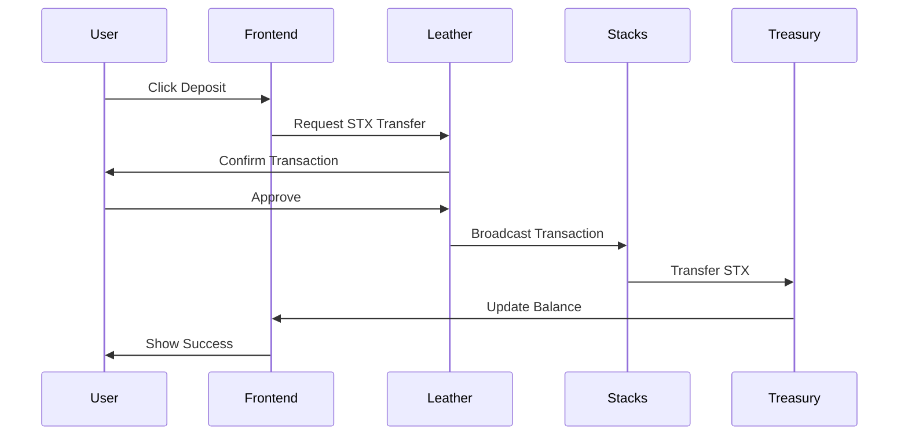
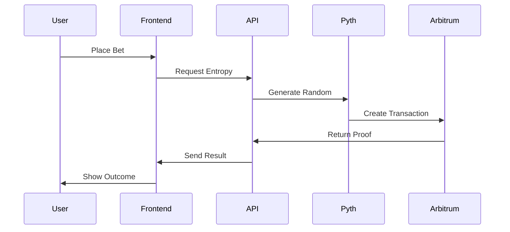

# 🎰 Stacks Casino

A decentralized casino platform built on **Stacks Network** with provably fair gaming using **Pyth Entropy** for randomness generation.

## 🌟 Features

### 🎮 Games
- **🎯 Plinko** - Drop balls through pegs with customizable risk levels
- **💎 Mines** - Navigate through a minefield to find treasures
- **🎡 Roulette** - Classic casino roulette with European layout
- **🎰 Spin Wheel** - Colorful wheel of fortune with multiple betting options

### 🔐 Wallet Integration
- **Stacks Wallet** - Primary wallet for STX deposits/withdrawals
- **Leather Wallet** - Native Stacks wallet support
- **Dual Network Support** - Stacks for gaming, Arbitrum for randomness

### 🎲 Provably Fair Gaming
- **Pyth Entropy** - Cryptographically secure randomness
- **On-chain Verification** - All random numbers are verifiable
- **Transparent Proofs** - View entropy proofs for each game

### 💰 Financial Features
- **STX Deposits** - Deposit STX tokens to your casino balance
- **Instant Withdrawals** - Withdraw winnings back to your Stacks wallet
- **Real-time Balance** - Live balance updates across all games

## 🏗️ Architecture

### Network Stack
```
┌─────────────────────────────────────────────────────────────┐
│                    Stacks Casino DApp                       │
├─────────────────────────────────────────────────────────────┤
│  Frontend (Next.js 14)                                     │
│  ├── React Components                                      │
│  ├── Stacks Wallet Integration                             │
│  ├── Game Logic & UI                                       │
│  └── Real-time Balance Management                          │
├─────────────────────────────────────────────────────────────┤
│  Blockchain Layer                                          │
│  ├── Stacks Network (STX Transactions)                     │
│  │   ├── Deposits & Withdrawals                            │
│  │   ├── User Authentication                               │
│  │   └── Balance Management                                │
│  └── Arbitrum Sepolia (Pyth Entropy)                       │
│      ├── Random Number Generation                          │
│      ├── Entropy Proofs                                    │
│      └── Game Verification                                 │
├─────────────────────────────────────────────────────────────┤
│  Backend Services                                          │
│  ├── Treasury Management                                   │
│  ├── Entropy API                                          │
│  ├── Game History                                         │
│  └── Balance Tracking                                     │
└─────────────────────────────────────────────────────────────┘
```

### Wallet Architecture
```
┌─────────────────────────────────────────────────────────────┐
│                   Dual Wallet System                       │
├─────────────────────────────────────────────────────────────┤
│  Primary Wallet (Stacks)                                   │
│  ├── Leather Wallet Integration                            │
│  ├── STX Token Management                                  │
│  ├── Deposit/Withdrawal Operations                         │
│  └── User Authentication                                   │
├─────────────────────────────────────────────────────────────┤
│  Secondary Wallet (Ethereum/Arbitrum)                      │
│  ├── Wagmi Integration                                     │
│  ├── Pyth Entropy Access                                  │
│  ├── Random Number Requests                               │
│  └── Proof Generation                                     │
└─────────────────────────────────────────────────────────────┘
```

## 🚀 Quick Start

### Prerequisites
- Node.js 18+ 
- npm or yarn
- Leather Wallet (for Stacks)
- MetaMask or compatible wallet (for Pyth Entropy)

### Installation

1. **Clone the repository**
```bash
git clone https://github.com/your-username/stacks-casino.git
cd stacks-casino
```

2. **Install dependencies**
```bash
npm install
```

3. **Environment Setup**
```bash
cp .env.example .env
```

4. **Configure Environment Variables**
```env
# Stacks Network Configuration
NEXT_PUBLIC_STACKS_NETWORK=testnet
NEXT_PUBLIC_STACKS_API_URL=https://api.testnet.stacks.co
CASINO_TREASURY_PRIVATE_KEY=your_treasury_private_key
NEXT_PUBLIC_CASINO_TREASURY_ADDRESS=your_treasury_address

# Pyth Entropy Configuration  
NEXT_PUBLIC_ARBITRUM_SEPOLIA_RPC=https://sepolia-rollup.arbitrum.io/rpc
TREASURY_PRIVATE_KEY=your_ethereum_private_key
```

5. **Start Development Server**
```bash
npm run dev
```

6. **Open Browser**
```
http://localhost:3000
```

## 🎮 How to Play

### 1. Connect Wallets
- **Connect Leather Wallet** for STX transactions
- **Connect MetaMask** for Pyth Entropy (optional, for enhanced randomness)

### 2. Deposit STX
- Click on your balance in the navbar
- Enter deposit amount
- Confirm transaction in Leather wallet
- Wait for confirmation

### 3. Choose a Game
- **Plinko**: Set risk level and rows, drop balls
- **Mines**: Choose mine count, reveal tiles
- **Roulette**: Place bets on numbers/colors
- **Wheel**: Bet on segments, spin the wheel

### 4. Withdraw Winnings
- Click on your balance
- Click "Withdraw All STX"
- Confirm transaction
- STX will be sent to your Stacks wallet

## 🔧 Technical Details

### Smart Contracts
- **Treasury Management**: Handles STX deposits and withdrawals
- **Pyth Entropy**: Provides cryptographically secure randomness
- **Game Logic**: Client-side with server-side verification

### Randomness Generation
```javascript
// Example: Plinko ball path generation
const randomData = await pythEntropyService.generateRandom('PLINKO', {
  rows: 16,
  riskLevel: 'Medium'
});

// Entropy proof contains:
// - Request ID
// - Sequence Number  
// - Transaction Hash
// - Random Value
// - Verification URL
```

### Deposit Flow


### Game Flow


## 🛠️ Development

### Project Structure
```
src/
├── app/                    # Next.js 14 App Router
│   ├── game/              # Game pages
│   │   ├── plinko/        # Plinko game
│   │   ├── mines/         # Mines game
│   │   ├── roulette/      # Roulette game
│   │   └── wheel/         # Wheel game
│   └── api/               # API routes
├── components/            # React components
├── contexts/             # React contexts
│   └── StacksWalletContext.js
├── hooks/                # Custom hooks
├── services/             # External services
│   └── PythEntropyService.js
├── utils/                # Utility functions
│   └── casinoWallet.js
└── config/               # Configuration files
```

### Key Components
- **StacksWalletContext**: Manages Stacks wallet connection
- **PythEntropyService**: Handles randomness generation
- **CasinoWallet**: Manages deposits and withdrawals
- **Game Components**: Individual game implementations

### Environment Variables
```env
# Stacks Configuration
NEXT_PUBLIC_STACKS_NETWORK=testnet
NEXT_PUBLIC_CASINO_TREASURY_ADDRESS=STZ2YCW72SDSCVYQKEPC3PNQ7J69EFTFERHEPC9
CASINO_TREASURY_PRIVATE_KEY=fb4a3ce058c6a421976ba68d03a0b20e991ef6d384e5f99f1b371966e41bdbba

# Pyth Entropy Configuration
NEXT_PUBLIC_ARBITRUM_SEPOLIA_RPC=https://sepolia-rollup.arbitrum.io/rpc
TREASURY_PRIVATE_KEY=0x080c0b0dc7aa27545fab73d29b06f33e686d1491aef785bf5ced325a32c14506
```

## 🔐 Security

### Wallet Security
- **Non-custodial**: Users maintain control of their private keys
- **Secure Connections**: All wallet interactions use secure protocols
- **Transaction Signing**: All transactions require user approval

### Randomness Security
- **Pyth Entropy**: Cryptographically secure random number generation
- **On-chain Verification**: All entropy proofs are verifiable on Arbitrum
- **Transparent Process**: Complete audit trail for all random numbers

### Smart Contract Security
- **Treasury Management**: Secure STX handling with proper access controls
- **Balance Tracking**: Client-side balance with server-side verification
- **Withdrawal Limits**: Configurable limits for security

## 🌐 Networks

### Stacks Testnet
- **Network**: Stacks Testnet
- **Currency**: STX
- **Explorer**: https://explorer.stacks.co/?chain=testnet
- **Faucet**: https://explorer.stacks.co/sandbox/faucet?chain=testnet

### Arbitrum Sepolia (for Pyth Entropy)
- **Network**: Arbitrum Sepolia
- **Currency**: ETH
- **Explorer**: https://sepolia.arbiscan.io/
- **Faucet**: https://faucet.quicknode.com/arbitrum/sepolia

## 📊 Game Statistics

### Plinko
- **Risk Levels**: Low, Medium, High
- **Rows**: 8-16 configurable
- **Max Multiplier**: Up to 1000x (16 rows, high risk)
- **House Edge**: ~1%

### Mines
- **Grid Size**: 5x5 (25 tiles)
- **Mine Count**: 1-24 configurable
- **Max Multiplier**: Up to 24x
- **House Edge**: ~1%

### Roulette
- **Type**: European (single zero)
- **Numbers**: 0-36
- **Max Payout**: 35:1 (straight up)
- **House Edge**: 2.7%

### Wheel
- **Segments**: 54 total
- **Colors**: 7 different colors
- **Max Multiplier**: 50x
- **House Edge**: ~4%

## 🤝 Contributing

1. Fork the repository
2. Create a feature branch (`git checkout -b feature/amazing-feature`)
3. Commit your changes (`git commit -m 'Add amazing feature'`)
4. Push to the branch (`git push origin feature/amazing-feature`)
5. Open a Pull Request

## 📄 License

This project is licensed under the MIT License - see the [LICENSE](LICENSE) file for details.

## 🆘 Support

- **Documentation**: Check this README and inline code comments
- **Issues**: Open an issue on GitHub
- **Discord**: Join our community server
- **Email**: support@stackscasino.com

## 🚀 Deployment

### Vercel (Recommended)
```bash
npm run build
vercel --prod
```

### Environment Variables for Production
```env
NEXT_PUBLIC_STACKS_NETWORK=mainnet
NEXT_PUBLIC_CASINO_TREASURY_ADDRESS=your_mainnet_address
CASINO_TREASURY_PRIVATE_KEY=your_secure_private_key
```

---

**Built with ❤️ on Stacks Network**

*Enjoy responsible gaming and may the odds be in your favor!* 🎰✨